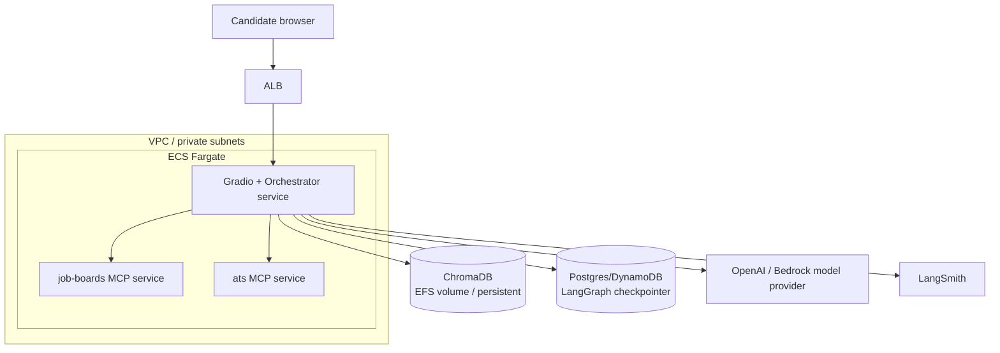

# Deployment — ECS Fargate & Bedrock AgentCore

Two supported deploy paths. Both build from `deploy/Dockerfile` (root as build context).

## Architecture



## Path A — ECS Fargate

- **Gradio + orchestrator** — one service, port 7860, behind an ALB.
- **MCP servers** — the HTTP MCP servers (`job-boards`, `ats`) run as separate
  services, reached at `http://job-boards:8001/mcp` and `http://ats:8002/mcp`
  (see `app/tools/mcp_client.py`). The `browser` MCP server runs over stdio in
  the orchestrator container, so it needs no separate service.
- **ChromaDB** — persist `CHROMA_DIR` on an EFS-backed volume (or swap to
  OpenSearch / pgvector for scale).
- **Checkpointer** — swap `InMemorySaver` in
  `app/agents/application_graph.py` for a Postgres/DynamoDB checkpointer so HITL
  interrupts survive task restarts.

### Required environment / secrets
- `OPENAI_API_KEY` — default model is `openai:gpt-4o-mini` (override with `MODEL`).
- `LANGSMITH_API_KEY` — tracing (`LANGSMITH_TRACING`/`LANGSMITH_PROJECT` are set in `app/config.py`).
- `CHROMA_DIR` — point at the mounted EFS path.

### Build & push
```bash
docker build -f deploy/Dockerfile -t ai-recruiter:latest .
# tag + push to ECR, then reference the image in the ECS task definitions
```

## Path B — Bedrock AgentCore

Best fit if standardizing on Bedrock models (set `MODEL=bedrock_converse:anthropic.claude-...`).

- Deploy the orchestrator to **AgentCore Runtime** via the CLI (`@aws/agentcore`).
- Expose the MCP servers through **AgentCore Gateway**.
- Use **AgentCore Memory + Observability** instead of self-managed state and LangSmith.
